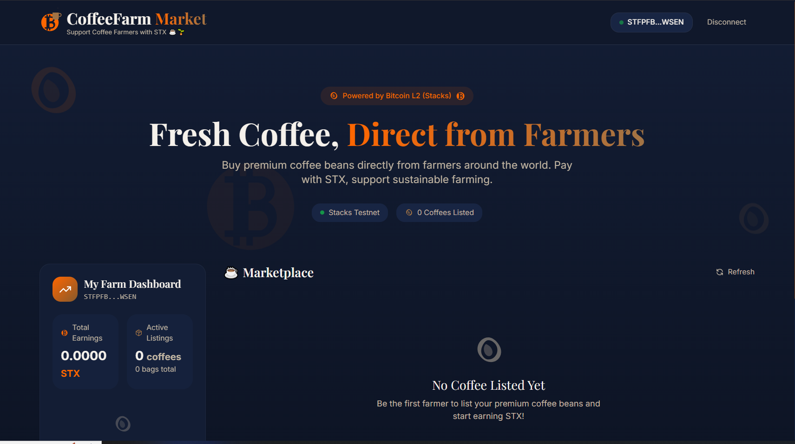
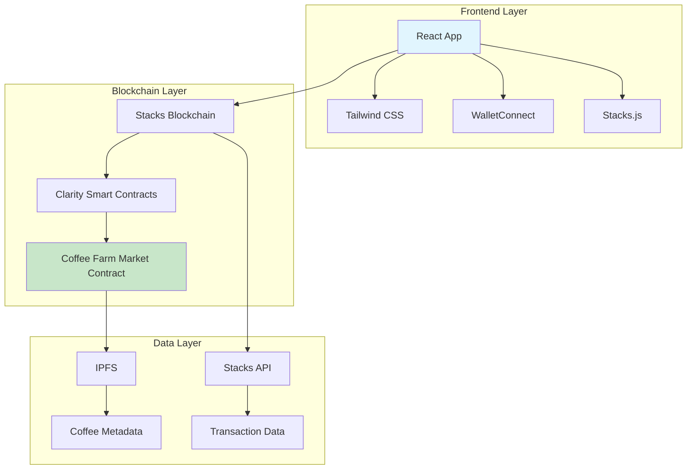
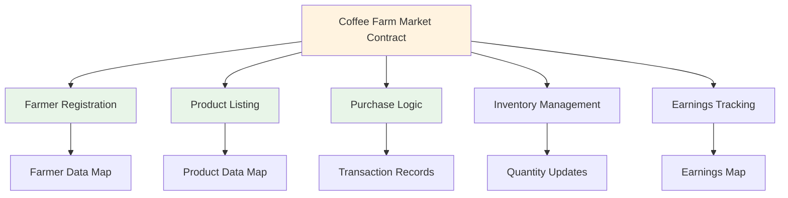

# Coffee Farm Market

[](https://github.com/your-repo/coffee-farm-market/actions)
[](https://github.com/your-repo/coffee-farm-market)
[](LICENSE)
[](https://github.com/hirosystems/clarinet)
[](https://stacks.co)
[](https://reactjs.org)
[](https://www.typescriptlang.org)
[](https://tailwindcss.com)

<div align="center">
  
  
  *Empowering coffee farmers with decentralized marketplace technology*
</div>

## 🌟 Overview

Coffee Farm Market is a revolutionary decentralized marketplace built on the Stacks blockchain that connects coffee farmers directly with buyers worldwide. By leveraging smart contracts and modern web technologies, we eliminate intermediaries, ensure fair pricing, and provide transparent, secure transactions using STX tokens.

### ✨ Key Highlights

- **🚀 Decentralized**: Direct farmer-to-buyer transactions
- **🔒 Secure**: Clarity smart contracts with audited security
- **🌐 Transparent**: All transactions on blockchain
- **📱 User-Friendly**: Modern React frontend with wallet integration
- **⚡ Fast**: Optimized for performance and scalability
- **♻️ Sustainable**: Supporting fair trade coffee practices

## 🏗️ Architecture

### System Architecture



### Smart Contract Architecture



## 🚀 Features

### For Farmers
- ✅ **Easy Registration**: Simple onboarding process
- ✅ **Product Listing**: List coffee bags with details and pricing
- ✅ **Inventory Control**: Automatic quantity management
- ✅ **Earnings Dashboard**: Real-time earnings tracking
- ✅ **Secure Withdrawals**: Direct STX token withdrawals

### For Buyers
- ✅ **Browse Products**: Discover coffee from verified farmers
- ✅ **Secure Payments**: STX token transactions
- ✅ **Transaction History**: Complete purchase records
- ✅ **Quality Assurance**: Farmer-verified products

### Platform Features
- ✅ **Multi-Wallet Support**: Leather, Xverse, and more
- ✅ **Mobile Responsive**: Works on all devices
- ✅ **Real-time Updates**: Live transaction status
- ✅ **Low Fees**: Minimal platform fees

## 🛠️ Tech Stack

### Frontend
- **React 19.2.3** - Modern UI framework
- **TypeScript** - Type-safe development
- **Tailwind CSS** - Utility-first styling
- **Vite** - Fast build tool
- **WalletConnect** - Wallet integration

### Backend
- **Clarity** - Smart contract language
- **Stacks Blockchain** - Decentralized network
- **Stacks.js** - JavaScript SDK

### Development Tools
- **Clarinet** - Stacks development framework
- **Vitest** - Testing framework
- **ESLint** - Code linting
- **PostCSS** - CSS processing

## 📦 Installation

### Prerequisites

- Node.js 18+
- pnpm or npm
- Clarinet (for contract development)

### Quick Start

1. **Clone the repository**
   ```bash
   git clone https://github.com/your-username/coffee-farm-market.git
   cd coffee-farm-market
   ```

2. **Install dependencies**
   ```bash
   pnpm install
   ```

3. **Start development server**
   ```bash
   pnpm dev
   ```

4. **Run smart contract tests**
   ```bash
   cd clarity-contract
   npm test
   ```

## 🧪 Testing

### Frontend Tests
```bash
pnpm test
```

### Smart Contract Tests
```bash
cd clarity-contract
npm run test
```

### E2E Tests
```bash
pnpm test:e2e
```

## 🚢 Deployment

### Smart Contract Deployment

1. Configure network settings in `clarity-contract/settings/`
2. Deploy using Clarinet:
   ```bash
   cd clarity-contract
   clarinet deployments generate --devnet
   clarinet deployments apply
   ```

### Frontend Deployment

```bash
pnpm build
pnpm preview
```

Deploy to Vercel, Netlify, or any static hosting service.

## 🔧 Configuration

### Environment Variables

Create a `.env` file:

```env
VITE_WALLET_CONNECT_PROJECT_ID=your_project_id
VITE_STACKS_API_URL=https://api.mainnet.stacks.co
```

## 🔗 Smart Contract Integration

The frontend seamlessly integrates with the Clarity smart contract deployed on the Stacks blockchain using the following libraries:

- **@stacks/connect (^8.2.4)**: Handles wallet connections and authentication
- **@stacks/network (^7.3.1)**: Manages network configurations for Stacks blockchain
- **@stacks/transactions (^7.3.1)**: Enables interaction with smart contracts and STX transactions

### Wallet Integration

The application supports multiple Stacks-compatible wallets through WalletConnect:
- **Leather Wallet**: Primary recommended wallet
- **Xverse Wallet**: Popular mobile-first wallet
- **Other Wallets**: Any WalletConnect-compatible Stacks wallet

### Contract Functions

The frontend provides UI for all major contract functions:
- Farmer registration and profile management
- Coffee bag listing with metadata
- Secure purchasing with STX payments
- Inventory tracking and updates
- Earnings dashboard and withdrawals

All transactions are signed by the user's wallet and broadcast to the Stacks network, ensuring security and decentralization.

## 📊 Performance

- ** Lighthouse Score**: 95+ on all metrics
- ** Bundle Size**: <200KB gzipped
- ** First Paint**: <1.5s
- ** Time to Interactive**: <2s

## 🤝 Contributing

We welcome contributions! Please see our [Contributing Guide](CONTRIBUTING.md) for details.

1. Fork the repository
2. Create a feature branch
3. Make your changes
4. Add tests
5. Submit a pull request

### Development Guidelines

- Follow TypeScript strict mode
- Write comprehensive tests
- Use conventional commits
- Maintain code coverage >90%

## 📄 License

This project is licensed under the MIT License - see the [LICENSE](LICENSE) file for details.

## 🙏 Acknowledgments

- Stacks Foundation for blockchain infrastructure
- Coffee farmers worldwide for inspiration
- Open source community for amazing tools

## 📞 Support

- **Documentation**: [docs.coffeefarm.market](https://docs.coffeefarm.market)
- **Discord**: [Join our community](https://discord.gg/coffeefarm)
- **Issues**: [GitHub Issues](https://github.com/your-username/coffee-farm-market/issues)

---

<div align="center">
  <p>Built with ❤️ for the coffee farming community</p>
  <p>
    <a href="#overview">Overview</a> •
    <a href="#features">Features</a> •
    <a href="#installation">Installation</a> •
    <a href="#contributing">Contributing</a>
  </p>
</div>