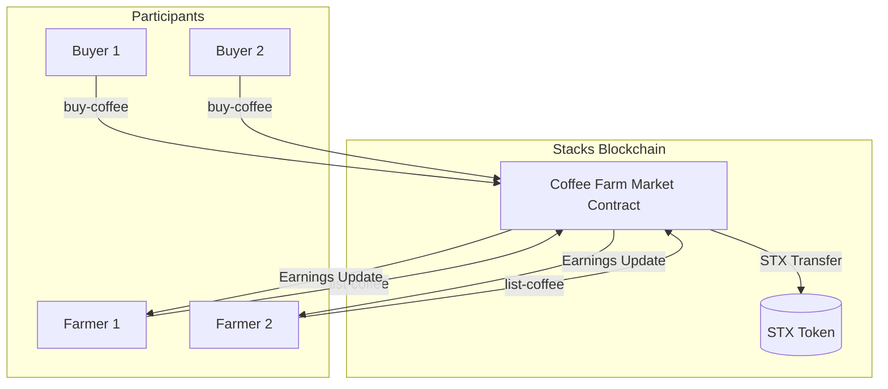
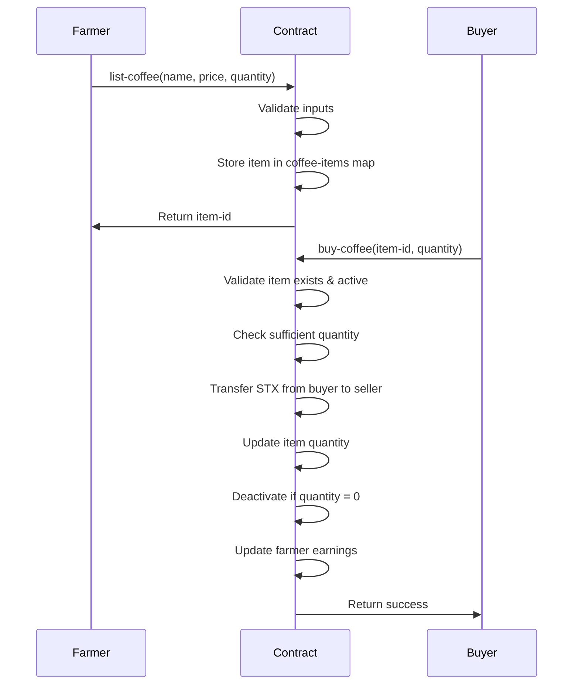
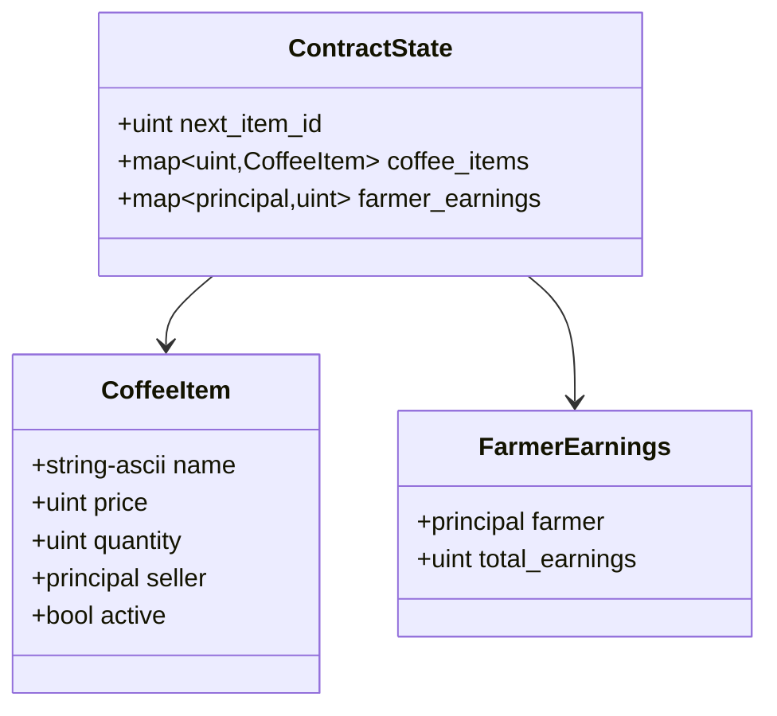

# Coffee Farmers Marketplace

[](https://github.com/your-repo/coffee-farm-market/actions)
[](https://github.com/your-repo/coffee-farm-market)
[](LICENSE)
[](https://github.com/hirosystems/clarinet)
[](https://stacks.co)

A decentralized marketplace smart contract built on the Stacks blockchain that enables coffee farmers to list and sell their coffee bags directly to buyers using STX tokens. The contract implements a secure, transparent marketplace with automated quantity management and earnings tracking.

## Table of Contents

- [Overview](#overview)
- [Architecture](#architecture)
- [Features](#features)
- [Smart Contract API](#smart-contract-api)
- [Installation](#installation)
- [Testing](#testing)
- [Deployment](#deployment)
- [Usage Examples](#usage-examples)
- [Security Considerations](#security-considerations)
- [Contributing](#contributing)
- [License](#license)

## Overview

The Coffee Farmers Marketplace is a Clarity smart contract deployed on the Stacks blockchain that creates a peer-to-peer marketplace for coffee farmers. Farmers can list coffee bags with specified prices and quantities, while buyers can purchase directly using STX tokens. The contract automatically manages inventory, handles payments, and tracks earnings for each farmer.

### Key Characteristics

- **Decentralized**: No intermediaries required for transactions
- **Transparent**: All transactions recorded on the blockchain
- **Secure**: Built with Clarity's type system and safety checks
- **Automated**: Smart contract handles all business logic
- **Scalable**: Supports multiple farmers and concurrent transactions

## Architecture

### System Architecture



### Data Flow



### Data Structures



## Features

### Core Functionality

- **Item Listing**: Farmers can list coffee bags with name, price, and quantity
- **Secure Purchasing**: Buyers can purchase coffee bags using STX tokens
- **Automatic Inventory Management**: Contract tracks and updates item quantities
- **Item Deactivation**: Items are automatically deactivated when sold out
- **Earnings Tracking**: Contract maintains earnings records for each farmer
- **Input Validation**: Comprehensive validation of all inputs and states

### Error Handling

The contract implements robust error handling with specific error codes:

- `u1`: Invalid price (must be > 0)
- `u2`: Invalid quantity (must be > 0)
- `u3`: Invalid buy quantity (must be > 0)
- `u4`: Item not found
- `u5`: Item inactive
- `u6`: Insufficient quantity available
- `u7`: Empty item name

## Smart Contract API

### Public Functions

#### `list-coffee`

Lists a new coffee item for sale.

**Parameters:**
- `name` (string-ascii 80): Name of the coffee bag
- `price` (uint): Price in microSTX per unit
- `quantity` (uint): Quantity available for sale

**Returns:**
- `(ok item-id)`: Success with the assigned item ID
- `(err error-code)`: Error with specific error code

**Validation:**
- Name length > 0
- Price > 0
- Quantity > 0

#### `buy-coffee`

Purchases coffee from a listed item.

**Parameters:**
- `item-id` (uint): ID of the item to purchase from
- `qty` (uint): Quantity to purchase

**Returns:**
- `(ok true)`: Successful purchase
- `(err error-code)`: Error with specific error code

**Validation:**
- Item exists
- Item is active
- Sufficient quantity available
- Buy quantity > 0
- STX transfer succeeds

### Read-Only Functions

#### `get-coffee-item`

Retrieves details of a specific coffee item.

**Parameters:**
- `id` (uint): Item ID to query

**Returns:**
- `some {name, price, quantity, seller, active}`: Item details if found
- `none`: Item not found

#### `get-next-item-id`

Gets the next available item ID for listing.

**Returns:**
- `uint`: Next item ID

#### `get-farmer-earnings`

Gets the total earnings for a specific farmer.

**Parameters:**
- `farmer` (principal): Farmer's address

**Returns:**
- `uint`: Total earnings in microSTX

## Installation

### Prerequisites

- [Node.js](https://nodejs.org/) (v16 or higher)
- [Clarinet](https://github.com/hirosystems/clarinet) (v2.9+)
- [Stacks CLI](https://docs.stacks.co/docs/stacks-cli) (optional, for advanced operations)

### Setup

1. Clone the repository:
   ```bash
   git clone <repository-url>
   cd coffee-farm-market
   ```

2. Install dependencies:
   ```bash
   npm install
   ```

3. Verify Clarinet installation:
   ```bash
   clarinet --version
   ```

## Testing

The project includes comprehensive unit tests written with Vitest and the Clarinet SDK.

### Running Tests

Execute the test suite:
```bash
npm test
```

### Test Coverage

The test suite covers:
- Successful item listing
- Successful purchases with quantity updates
- Automatic item deactivation when sold out
- Error handling for all edge cases
- Multiple farmer earnings tracking
- Read-only function validation

### Test Structure

```
tests/
├── coffee-farm-market.test.ts    # Main test suite
```

### Continuous Testing

For development with automatic test execution:
```bash
npm run test:watch
```

## Deployment

### Testnet Deployment

The contract has been deployed to Stacks testnet.

**Contract Address:** `STGDS0Y17973EN5TCHNHGJJ9B31XWQ5YXBQ0KQ2Y.coffee-farm-market`

**Transaction:** [View on Explorer](https://explorer.stacks.co/txid/...)

### Local Development

Deploy to local Clarinet environment:
```bash
clarinet console
```

### Production Deployment

For mainnet deployment:

1. Update `settings/Mainnet.toml` with production account
2. Generate deployment plan:
   ```bash
   clarinet deployments generate --mainnet --medium-cost
   ```
3. Review and apply deployment:
   ```bash
   clarinet deployments apply --mainnet
   ```

## Usage Examples

### Listing Coffee

```typescript
// Using Clarinet SDK
const { result } = simnet.callPublicFn(
  'coffee-farm-market',
  'list-coffee',
  [
    Cl.stringAscii('Premium Arabica'),
    Cl.uint(1000000), // 1 STX per bag
    Cl.uint(50)       // 50 bags available
  ],
  farmerAddress
);

console.log('Item listed with ID:', result.value);
```

### Purchasing Coffee

```typescript
// Using Clarinet SDK
const { result } = simnet.callPublicFn(
  'coffee-farm-market',
  'buy-coffee',
  [
    Cl.uint(1),    // Item ID
    Cl.uint(5)     // Quantity to buy
  ],
  buyerAddress
);

console.log('Purchase successful:', result.type === 'ok');
```

### Checking Item Details

```typescript
// Using Clarinet SDK
const item = simnet.callReadOnlyFn(
  'coffee-farm-market',
  'get-coffee-item',
  [Cl.uint(1)],
  address
);

if (item.result.type === 'some') {
  console.log('Item:', item.result.value);
}
```

### Checking Farmer Earnings

```typescript
// Using Clarinet SDK
const earnings = simnet.callReadOnlyFn(
  'coffee-farm-market',
  'get-farmer-earnings',
  [Cl.principal(farmerAddress)],
  address
);

console.log('Total earnings:', earnings.result.value);
```

## Security Considerations

### Input Validation

- All public functions validate inputs before processing
- String lengths are bounded to prevent overflow
- Numeric values are checked for reasonable ranges

### Access Control

- Only item sellers can modify their listings (implicit through tx-sender)
- Read-only functions are publicly accessible
- No privileged operations or admin functions

### Economic Security

- STX transfers are atomic with state updates
- No reentrancy vulnerabilities (Clarity's design prevents this)
- Earnings tracking prevents double-spending

### Audit Recommendations

- Third-party security audit recommended before mainnet deployment
- Monitor contract usage and gas costs
- Consider upgrade mechanisms for future enhancements

## Contributing

### Development Process

1. Fork the repository
2. Create a feature branch: `git checkout -b feature/your-feature`
3. Make changes and ensure tests pass: `npm test`
4. Run contract checks: `clarinet check`
5. Submit a pull request with detailed description

### Code Standards

- Follow Clarity best practices and naming conventions
- Include comprehensive test coverage for new features
- Update documentation for API changes
- Use descriptive commit messages

### Testing Requirements

- All new features must include unit tests
- Test both success and failure scenarios
- Maintain 100% test coverage
- Test gas costs for complex operations

## License

This project is licensed under the MIT License - see the [LICENSE](LICENSE) file for details.

---

**Built with [Clarity](https://clarity-lang.org/) on the [Stacks](https://stacks.co) blockchain.**